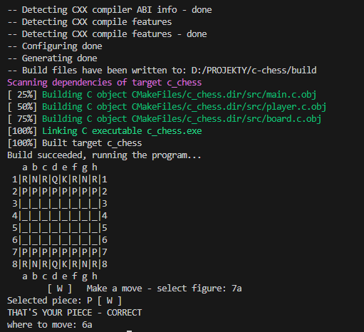

# C CHESS
C chess two player-game

# HOW TO BUILD
## LINUX
./build_and_run.sh

will do the thing.

## WINDOWS
./build_and_run.sh

should do the thing as well.
Notice that for Windows CMAKE_C_COMPILER and CMAKE_CXX_COMPILER paths are specified in the CMakeLists.txt. Same thing for DCMAKE_MAKE_PROGRAM in build_and_run.sh
